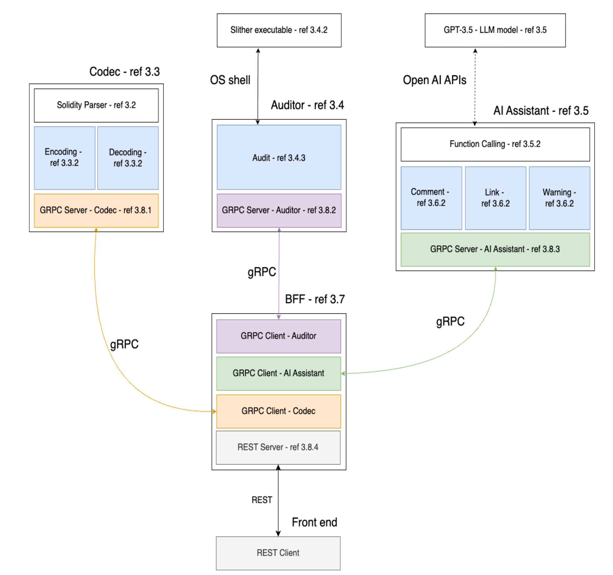
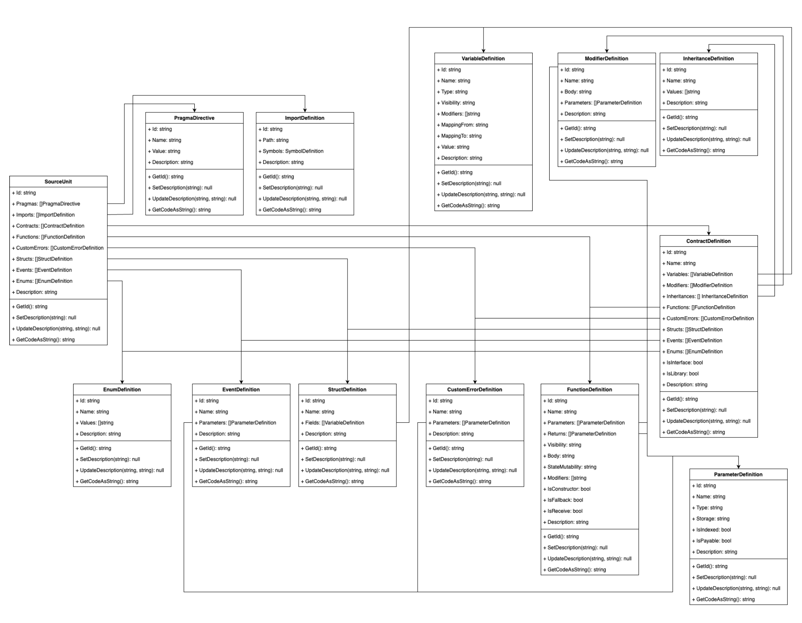

## POLITECNICO DI TORINO -  Master’s Degree in SOFTWARE ENGINEERING 
# Smart Contract Analysis and Visualization Software

The thesis presents the design and development of a software for simplifying the reading, editing and security analysis of smart contracts. The system is based on a combination of atomic microservices and a modern frontend. The tool provides an easy to use environment, error resistant and ready for people with limited skills in programming. The main part of the project is a network of 3 services, each one responsible for a specific function. The Codec takes care of transforming the smart contract code into a JSON structure, and vice versa. The Auditor executes a security analysis with Slither and returns critical information that can help the user to avoid common vulnerabilities. The Assistant relies on Large Language Models (LLMs), specifically through integration with ChatGPT APIs, to generate descriptions and highlight the functional relationships within the elements. The Backend For Frontend pattern was used for managing communication and data flow between services and the frontend. This one has been developed in Flutter for increasing cross platform and device compatibility. It takes care of visually representing the elaboration results inside a navigable grid of elements, where each of them can be investigated and edited. While the tool successfully demonstrates the potential for integrating multiple technologies to simplify smart contract development, it highlights areas for improvement. Particularly prone to this is the frontend, which can be further improved to fully abstract the code from the user. Overall, this thesis contributes to the field by showcasing integration of microservices, LLMs and visualization techniques in modern technologies.

## Documents

Thesis [301270_master_thesis.pdf](301270_master_thesis.pdf) 

Summary [301270_summary.pdf](301270_summary.pdf) 

Deployment procedure: [deployment_procedure.md](deployment/deployment_procedure.md)

Presentation: [301270_presentation.pdf](301270_presentation.pdf) 

Survey results: [survey_results](survey_results/) 

## Architecture

## License

Author: 
Lorenzo Gangemi

Supervisors:
Prof. Valentina GATTESCHI &
Eng. Emanuele Antonio NAPOLI

Shield: [![CC BY 4.0][cc-by-shield]][cc-by]

This work is licensed under a
[Creative Commons Attribution 4.0 International License][cc-by].

[![CC BY 4.0][cc-by-image]][cc-by]

[cc-by]: http://creativecommons.org/licenses/by/4.0/
[cc-by-image]: https://i.creativecommons.org/l/by/4.0/88x31.png
[cc-by-shield]: https://img.shields.io/badge/License-CC%20BY%204.0-lightgrey.svg